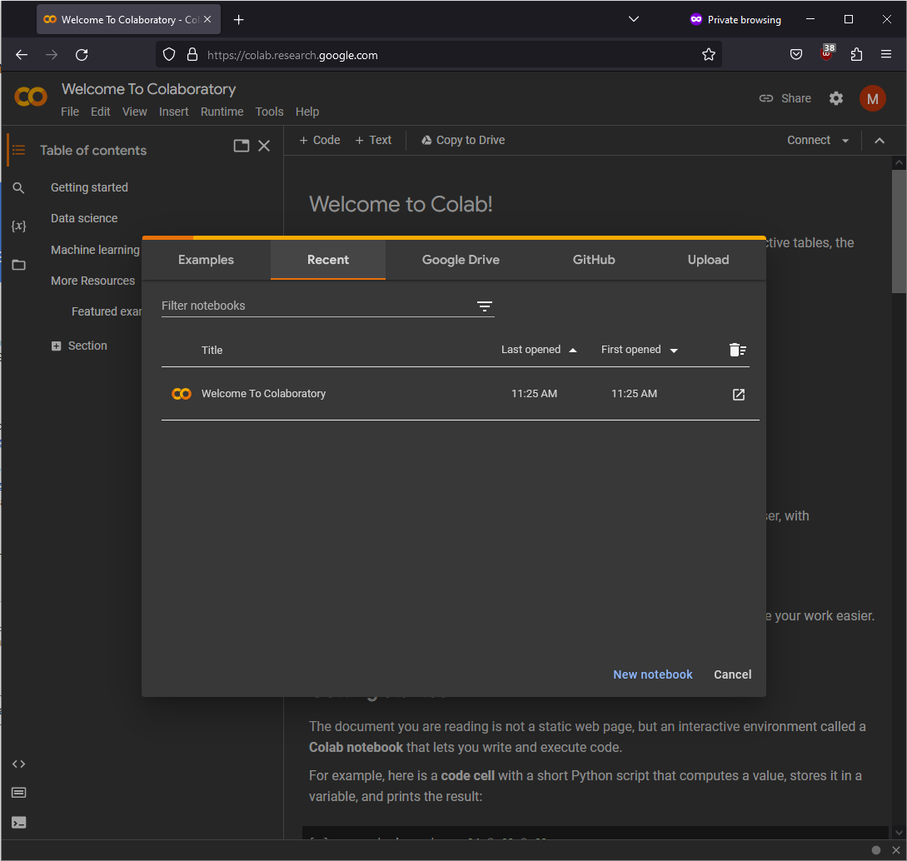
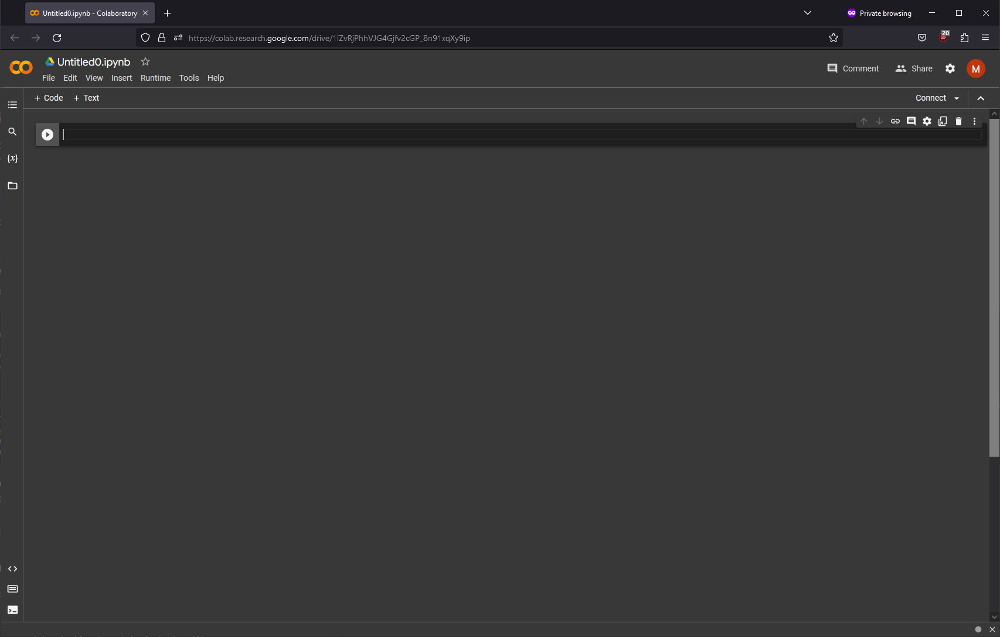
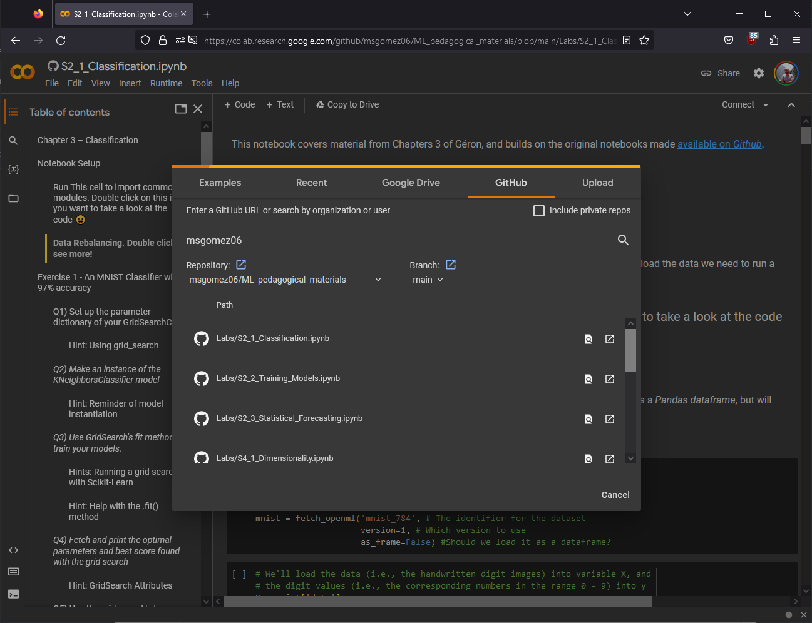

# First Time Coding in Python?
This section will help you figure out how to run scripts using Python. As you may be aware of by now, Python is an _interpreted_ language. This means that you don't need to compile code before running it, but it comes with a downside - you need to have an environment that meets all of the requirements of your script before you can run the code.

## What do I mean by environment?
In this context, environment refers to the base Python interpreter, which translates the code you write in Python to commands computers can understand and execute, plus any other required libraries and modules (i.e., code written by others that has conveniently been shared with you and which generally makes coding more straightforward). These libraries allow you to, e.g., efficiently carry out numerical operations (Numpy), effectively handle data structure and data analysis tasks (Pandas), and even implement state of the art machine learning solutions (SciKit Learn, Tensorflow, PyTorch).

Today, we'll be looking at three options for running Python code:
1. Google Colaboratory (oftened shortened to Colab)
> Colab is a service run by Google, and gives you (limited) access to their CPUs, GPUs, and even TPUs! Colab is based on Jupyter Notebooks, and is meant to allow you to write and execute Python code from within your browser free of charge. It has many popular machine learning libraries installed, and has APIs to interact with Google services (e.g., Drive). Colab, however, requires you to log in with a Google account, which you may understandably may not have or want to have.  
>> *Plusses*: Free of Charge, Integrates with Google services, Integrates with GitHub, *Requires no setup on your end for most tasks*    
>> *Minuses*: Your code will be stored and run on Google servers, Requires the use of a Google Account, Limited Resources, Limited to Interactive Scripts  
2. Binder
> Like Colab, Binder is an online platform that allows you to write and execute Python code from your browser. Unlike Colab, The Binder Project is an *open-source* initiative that allows the creation of custom computing environments for interactive and reproducible data science and scientific computing. With it, you can turn GitHub repositories containing Jupyter notebooks or other data science code into executable environments that others can launch and interact with online, without the need to install anything locally.  
>> *Plusses*: Free of charge, Open Source, Integrates with GitHub, *Requires no setup on your end for most tasks*, Support for Complex Environments (including Docker)  
>> *Minuses*: Limited Resources, Setup complexity for new users, Building time can be long, Your code will be stored and run on external servers, *you cannot save changes made to the files in the server; you have to download the files*
3. Conda (using Miniconda)  
> Conda is a package manager that allows you to create and manage environments for Python and other languages. It is a very powerful tool, and is the recommended way to manage your Python environments. Conda is available in two versions: Anaconda and Miniconda. Anaconda is a full-fledged distribution of Python, and comes with many pre-installed packages. Miniconda, on the other hand, is a minimal version of Anaconda, and only comes with the bare minimum to get you started. We will be using Miniconda today, as it is much lighter and easier to install. Additionally, we can use Conda with a variety of IDEs (Integrated Development Environments), which allow us to write and execute Python code from our computers.  
>> *Plusses*: Free of charge, Open Source and Cross-Platform, *Allows you to create and manage your own environments*, *handles library dependency compatibility for your environments*, Your code will be stored and run on the computer where Conda is installed (*You can run code offline*)  
>> *Minuses*: Setup complexity for new users, *Requires you to install software on your computer*, *Requires you to manage your environments*  

Let's go over how to use each of these options.

## Google Colaboratory
To use Colab, you need to have a Google account. If you don't have one, you can create one [here](https://accounts.google.com/signup/v2/webcreateaccount?flowName=GlifWebSignIn&flowEntry=SignUp). Once you have an account, you can access Colab [here](https://colab.research.google.com/). You should see a screen like this:  


From this page, you can open up a new notebook by clicking on 'New Notebook' or by clicking on 'File' and then 'New Notebook'. You should then see a screen like this:


You can now write and execute Python code in this notebook. To execute a cell, you can either click on the 'play' button to the left of the cell, or you can press 'Shift+Enter' on your keyboard. Try it out by copying the following text into a cell and executing the code:

```python
print('Here is the list of all the packages installed in this environment:')
!pip list
```

This is nice, but what we're most interested in today is to be able to run tutorials hosted on GitHub. There are a couple of ways to do this,
1. If the jupyter notebook hosted on GitHub and was uploaded via the Colab interface, you can simply click on the "Open in Colab" button at the top of the page.  
 <br>
This will open the notebook in Colab, and you can then execute the code as you would normally. You can find an example of this [here](https://github.com/msgomez06/ML_pedagogical_materials/blob/main/Labs/S2_1_Classification.ipynb). This notebook is part of a series materials developed for a course on Machine Learning given at UNIL, and is hosted on GitHub.  

2. If the notebook is hosted on GitHub, but was not uploaded via the Colab interface, you can use the URL pattern in order to open it on Colab.  
As an example, we'll use the notebooks developed by Jesper Dramsch for the EuroSciPy 2022 tutorial [Machine Learning for Science Reproducibility](https://github.com/JesperDramsch/ml-for-science-reproducibility-tutorial/tree/main). Though the materials have been prepared for opening with Colab and Binder (as evidenced by the _open on_ widgets on the main Readme.md), let's pretend they weren't and [view the first notebook on GitHub](https://github.com/JesperDramsch/ml-for-science-reproducibility-tutorial/blob/main/book/notebooks/0-basic-data-prep-and-model.ipynb). When viewing the hosted notebook in your browser, you should see that the URL is  
`https://github.com/JesperDramsch/ml-for-science-reproducibility-tutorial/blob/main/book/notebooks/0-basic-data-prep-and-model.ipynb`.  
To open this notebook in Colab, you need to replace `github.com` with `colab.research.google.com/github`.  
The resulting URL should be  
`https://colab.research.google.com/github/JesperDramsch/ml-for-science-reproducibility-tutorial/blob/main/book/notebooks/0-basic-data-prep-and-model.ipynb`  
If you open this URL, you should see the notebook open in Colab, and you can execute the code as you would normally.
Try it out by yourself with the following notebook:
`https://github.com/JesperDramsch/ml-for-science-reproducibility-tutorial/blob/main/book/notebooks/1-model-evaluation.ipynb`

3. You can also use Colab's `Open Notebook` command from the file menu, which will allow you to search through GitHub repositories by user, as shown in the screenshot below.  
 <br>

## Binder
Binder is a bit more complicated to use than Colab, but it is also more powerful. We won't go into the details of how to create a Binder environment, but we will go over how to use one.

Let's start by opening the Binder environment for the EuroSciPy 2022 tutorial [Machine Learning for Science Reproducibility](https://mybinder.org/v2/gh/JesperDramsch/ml-for-science-reproducibility-tutorial/HEAD). You should see a screen like this:
 <br>
This screen indicates that Binder is building the environment for you.  
_This can take a while, so please be patient._  
Once the environment is built, you should see a screen like this:  
 <br>
Unlike with Colab, Binder launches a full instance of JupyterLab and not just the notebook interface. This allows you to open and edit multiple notebooks at the same time, and even to open other files (e.g., images, text files, etc.)! You can use the file explorer on the left plane to browse the contents of the repository, and you can open a notebook by double-clicking on it. Here is the first notebook in the repository, `0-basic-data-prep-and-model.ipynb`:  
 <br>
Note that if you want to run this notebook, at the time of writing, you should change the line  
`DATA_FOLDER = Path("..") / "data"`  
to  
`DATA_FOLDER = Path("../..") / "data"`

## Conda (using Miniconda)
Conda is a much more flexible solution for running Python code, but it requires you to install software on your computer. In this tutorial, we'll go over how to install Miniconda on Windows and Linux (apologies to those on OSX - I don't have access to a Mac, so I can't provide the same level of instructions for you - it should however be quite similar).

Before we get into the installation, let's go over some basic terminology:

### Terminology
- **Package**: A package is a collection of code that can be installed and used in Python. Packages can be installed from a variety of sources, including the Python Package Index (PyPI), Anaconda Cloud, and Conda-Forge. Packages can be installed using the `conda` command, or using `pip` (the Python Package Installer). We will be relying on `conda`, as it ensures that all of the dependencies of a package are installed as well (and checks for conflicts between packages)
- **Virtual Environment**: Like we mentioned before, an environment is a collection of packages that are installed in a specific location - Python environments contain all of the software needed to interpret code and run Python Scripts. Virtual environments are useful because they allow you to have different versions of packages installed in different environments, and they allow you to easily share your environment with others. Environments can be created using the `conda` command, or using `pipenv` (the Python Package Installer Environment).
- **Channel**: A channel is a source for packages. The default channel is the Anaconda channel, which contains packages that have been tested by the Anaconda team. Other channels include Conda-Forge, which contains packages that have been tested by the Conda-Forge team, and PyPI, which contains packages that have been uploaded by the community. Channels can be specified when installing packages using the `conda` command.

### Installing Miniconda
To install Miniconda, you need to download the installer for your operating system from [here](https://docs.conda.io/en/latest/miniconda.html). Once you have downloaded the installer, you can run it to install Miniconda.

#### Windows
Once you have downloaded the installer, run it and follow the instructions with the default settings. You should now have a program called `Anaconda Prompt` and `Anaconda Powershell Primpt` installed on your computer. These programs allows you to run commands in a terminal with the correct environment activated - let's start by opening 'Anaconda Powershell Prompt'. You should see a screen like this:  
 <br>
Notice the `(base)` at the beginning of the line - this indicates that the `base` environment is currently active. Let's create a new environment called `test_env` by running the following command:
```bash
conda create -n test_env
```
You should be asked to confirm the installation of the new environment by typing `y` and pressing `Enter`. Once the environment is created, you should see a screen like this:
 <br>
If you run the `conda env list` command, you should now see both the `base` and `test_env` environments listed. Let's go ahead and activate the `test_env` environment by running the following command:
```bash
conda activate test_env
```
If you run `conda list`, you'll get a list of the packages installed on the virtual environment. For the moment, that list is empty! (We did, after all, just create a blank virtual environment)
Let's go ahead and install ipython, short for interactive python, and which will let us run Python code interactively. To do this, we'll run the following command:
```bash
conda install ipython
```
Conda will generate a list of packages that will be installed, and will ask you to confirm the installation by typing `y` and pressing `Enter`. Once the installation is complete, you should see a screen like this:  
 <br>
Now type in `ipython` and press `Enter`. You should see a screen like this:  
 <br>
Try running a small program that prints out the numbers from 0 to 9:
```python	
[print(number) for number in range(10)]
```
You should see the following:  
 <br>
Once you're done with ipython, simply type `exit()` and press `Enter` to exit the program.
Let's now install a few commonly used packages. To do this, we'll use a different channel than the default one. Simply add `-c conda-forge` as an option to the install command, as shown below:  
```bash
conda install -c conda-forge numpy pandas matplotlib
```
Congratulations, you have a working Python environment! We'll go over how to install IDEs in the next section; just skip over the Linux section for now.

#### Linux
After you've downloaded the installer, open a terminal and navigate to the directory where you downloaded the installer. Assuming you used Firefox, the default command to take you to the directory where the installer is located is:
```bash
cd ~/Downloads
```
Once you're in the correct directory, run the following command to make the installer executable:
```bash
chmod +x Miniconda3-latest-Linux-x86_64.sh
```
Then, run the installer:
```bash
bash Miniconda3-latest-Linux-x86_64.sh
```
You will be prompted to accept the license agreement. Press `Space` to scroll through the license agreement, and then type `yes` and press `Enter` to accept the license agreement. You will then be asked to confirm the installation location. Press `Enter` to accept the default location. You will then be asked if you want to initialize Miniconda3 by running `conda init`. Type `yes` and press `Enter` to accept. Restart your terminal, and you should now see `(base)` next to the prompt. This indicates that the `base` environment is currently active:  
 <br>
Let's create a new environment called `test_env` by running the following command:
```bash
conda create -n test_env
```
You should be asked to confirm the installation of the new environment by typing `y` and pressing `Enter`. Once the environment is created, you should see a screen like this:
 <br>
If you run the `conda env list` command, you should now see both the `base` and `test_env` environments listed. Let's go ahead and activate the `test_env` environment by running the following command:
```bash
conda activate test_env
```
If you run `conda list`, you'll get a list of the packages installed on the virtual environment. For the moment, that list is empty! (We did, after all, just create a blank virtual environment)
Let's go ahead and install ipython, short for interactive python, and which will let us run Python code interactively. To do this, we'll run the following command:
```bash
conda install ipython
```
Conda will generate a list of packages that will be installed, and will ask you to confirm the installation by typing `y` and pressing `Enter`. Once the installation is complete, you should see a screen like this:  
 <br>
Now type in `ipython` and press `Enter`. You should see a screen like this:  
 <br>
Try running a small program that prints out the numbers from 0 to 9:
```python	
[print(number) for number in range(10)]
```
You should see the following:  
 <br>
Once you're done with ipython, simply type `exit()` and press `Enter` to exit the program.
Let's now install a few commonly used packages. To do this, we'll use a different channel than the default one. Simply add `-c conda-forge` as an option to the install command, as shown below:  
```bash
conda install -c conda-forge numpy pandas matplotlib
```
Congratulations, you have a working Python environment! We'll go over how to install IDEs in the next section.

### Integrated Development Environments (IDEs)

IDEs are software that provide you with tools for writing code. While it _is_ true that you could write your programs in any text editor, you'll quickly run into issues - did you spell everything correctly? What arguments did `my_function` take again? What part of your code caused your script to fail? What is the current value of `my_variable`? IDEs can help answer these and many other questions.

Today, we'll be looking at three IDEs: Jupyter, Spyder, and Visual Studio Code (VScode for short). Jupyter is a web-based IDE that allows you to write and execute code in a web browser. Spyder is a desktop IDE that allows you to write and execute code in a single window. VScode is a desktop IDE that allows you to write and execute code in a single window, and which also provides you with a variety of tools for debugging and managing your code (including plugins for GitHub Copilot - an AI assistant that is free for students - at the time of writing, at least).

#### Jupyter Notebook
We'll be using Jupyter Notebook for this tutorial, but there is also a JupyterLab interface that is more similar to Spyder and VScode. To install Jupyter, simply run the following command:
```bash
conda install -c conda-forge jupyter
```

*THATS IT!* You now have a working Python environment with Jupyter installed! To launch Jupyter, simply run the following command:
```bash
jupyter notebook
```
You should see a screen like this:  
 <br>
You can now browse to wherever you have your notebooks stored and open them. You can also create new notebooks by clicking on the `New` button on the top right corner of the screen.
For the documentation on Jupyter Notebook, please refer to the [official documentation](https://jupyter-notebook.readthedocs.io/en/stable/).

